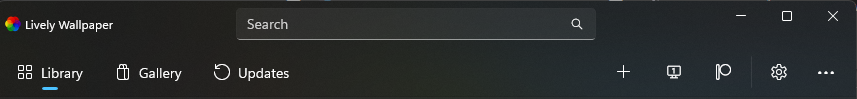
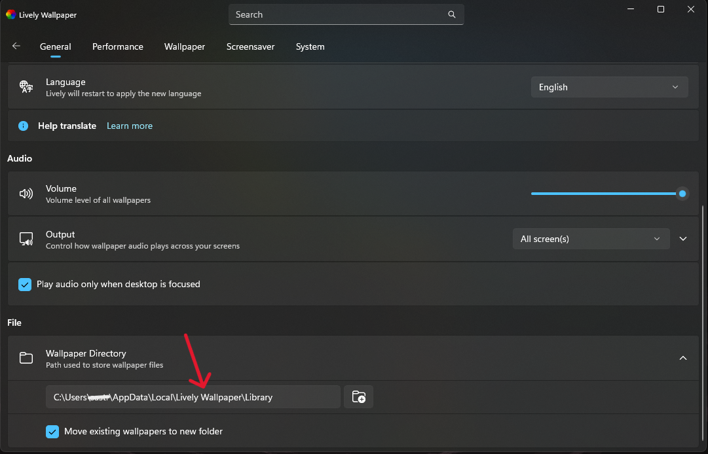
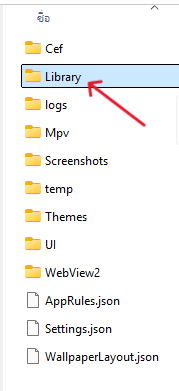
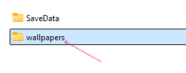
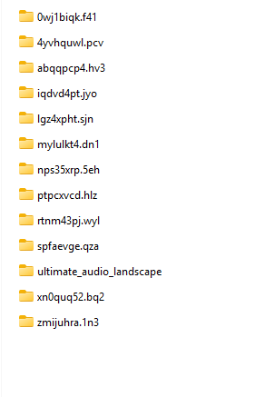
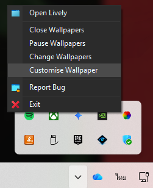

# 🌌 Ultimate Audio Landscape (Lively Wallpaper)

วอลเปเปอร์แบบตอบสนองต่อเสียงเพลง (Audio-Reactive) สำหรับโปรแกรม **Lively Wallpaper** ที่มาพร้อมกับภูเขา 3 มิติสไตล์ Wireframe, เส้นกราฟเสียงวงกลม (Circle Visualizer), หน้าปกอัลบั้มแบบไดนามิก, เอฟเฟกต์ฝนดาวตก และดวงดาวระยิบระยับ

---

## 📥 วิธีการติดตั้ง (Installation)

1. **ดาวน์โหลด** ไฟล์โค้ดของโปรเจกต์นี้ (ดาวน์โหลดเป็น `.zip`)
2. เปิดโปรแกรม **Lively Wallpaper** แล้วกดที่ปุ่ม **⚙️ (Settings)**
    
3. ในหน้าต่างตั้งค่า ให้หาที่อยู่ของ Lively Wallpaper แล้ว **กดตรงช่องที่อยู่ได้เลย** (ไม่ใช่ปุ่ม +)
    
4. กดเปิดเข้าไปในโฟลเดอร์ **`Library`**
    
5. กดเปิดเข้าไปในโฟลเดอร์ **`wallpapers`**
    
6. **แตกไฟล์ `.zip`** ที่ดาวน์โหลดมาลงในโฟลเดอร์นี้ คุณจะได้โฟลเดอร์ชื่อ `ultimate_audio_landscape`
    
7. **ปิดโปรแกรม Lively Wallpaper** โดยคลิกขวาที่ไอคอนในเมนูซ่อนไอคอน (System Tray) มุมขวาล่างของจอ แล้วกดออก
    
8. **เปิดโปรแกรม Lively Wallpaper ขึ้นมาใหม่** คุณจะเห็นวอลเปเปอร์ "Ultimate Audio Landscape" ปรากฏอยู่ในหน้ารวม (Library) พร้อมใช้งานทันที!

---

## ⚙️ การตั้งค่าและเมนูต่างๆ (Customize Settings)

คุณสามารถปรับแต่งวอลเปเปอร์นี้ได้ตามใจชอบ โดยคลิกขวาที่วอลเปเปอร์ใน Lively แล้วเลือก **"Customize"**

### 🎨 หมวดสีสัน (Colors & Theme)
*   **Auto Color (ดึงสีจากหน้าปก):** หากเปิดไว้ วอลเปเปอร์ (ภูเขา, กราฟเสียง, ตัวหนังสือ) จะเปลี่ยนสีอัตโนมัติตามสีหลักของหน้าปกอัลบั้มเพลงที่กำลังเล่นอยู่
*   **Background Color:** สีพื้นหลังหลัก (จะเห็นชัดถ้าปิดภาพพื้นหลังเบลอ)
*   **Hill Color:** สีของเส้นภูเขา 3 มิติ (ใช้ได้เมื่อปิด Auto Color)
*   **Font Color:** สีของชื่อเพลงและศิลปิน (ใช้ได้เมื่อปิด Auto Color)

### 🎵 หมวดเสียงและหน้าปก (Audio & Album Art)
*   **Album Art Background:** เปิด/ปิด ภาพหน้าปกอัลบั้มขนาดใหญ่ที่ถูกเบลอเป็นพื้นหลัง
*   **Background Blur Intensity:** ปรับระดับความเบลอของภาพพื้นหลัง ยิ่งค่าเยอะยิ่งเบลอมาก
*   **Square Album Art:** เปลี่ยนรูปทรงหน้าปกอัลบั้มตรงกลาง จากวงกลมเป็นสี่เหลี่ยม
*   **Album Art Rotation:** เปิด/ปิด ให้หน้าปกอัลบั้มหมุนวนไปเรื่อยๆ คล้ายแผ่นเสียง
*   **Show Album Art & Text:** เปิด/ปิด การแสดงผลหน้าปกอัลบั้มและชื่อเพลงตรงกลางจอ

### 📊 หมวดกราฟเสียง (Visualizer)
*   **Show Visualizer:** เปิด/ปิด การแสดงผลกราฟเสียง
*   **Visualizer Style:** เลือกรูปแบบกราฟ (Circle = เรียงเป็นวงกลม, Square = เรียงเป็นทรงสี่เหลี่ยม)

### 🏔️ หมวดภูเขา 3 มิติ (3D Mountain)
*   **Show Mountain:** เปิด/ปิด เส้นโครงข่ายภูเขา 3 มิติด้านล่าง
*   **Mountain Speed:** ความเร็วในการเคลื่อนที่ไปข้างหน้าของภูเขา
*   **Hill Opacity:** ปรับความโปร่งใสของเส้นภูเขา (ลดค่าลงถ้าแสบตา)

### 🌠 หมวดฝนดาวตกและดวงดาว (Meteor & Stars)
*   **Meteor Frequency (Seconds):** ความถี่ในการเกิดฝนดาวตกแต่ละระลอก (1 ถึง 10 วินาที)
*   **Meteor Amount:** จำนวนดาวตกที่จะตกลงมาในแต่ละระลอก (ใส่เป็นตัวเลข)
*   **Meteor Direction:** เลือกทิศทางที่ดาวจะตกลงมา (จากบนซ้าย หรือ จากบนขวา)
*   **Show Background Stars:** เปิด/ปิด ดวงดาวระยิบระยับที่เป็นพื้นหลัง
*   **Star Count:** จำนวนดวงดาวระยิบระยับ (แนะนำ 100 - 200)

### 💻 หมวดประสิทธิภาพ (Performance & Display)
*   **Mouse Parallax:** เปิด/ปิด เอฟเฟกต์ภาพขยับตามเมาส์
*   **Parallax Intensity:** ปรับความแรงของการขยับตามเมาส์
*   **Display Scaling:** ปรับลดสเกลภาพ 3 มิติ หากคอมพิวเตอร์กระตุก สามารถลดลงเหลือ 0.7 หรือ 0.5 เพื่อเพิ่มความลื่นไหลได้

### 🕒 หมวดนาฬิกาและวันที่ (Clock & Date)
*   **Show Time:** เปิด/ปิด การแสดงเวลานาฬิกา
*   **Show Date:** เปิด/ปิด การแสดงวันที่
*   **12-Hour Format:** เปิด/ปิด รูปแบบเวลาแบบ 12 ชั่วโมง (AM/PM) (หากปิดจะเป็นแบบ 24 ชั่วโมง)
*   **MM/DD/YY Format:** เปิด/ปิด รูปแบบวันที่เป็น เดือน/วัน/ปี (หากปิดจะเป็น วัน/เดือน/ปี)
*   **Clock Size:** ปรับขนาดของนาฬิกาและวันที่
*   **Clock Position X / Y:** เลื่อนตำแหน่งนาฬิกาบนหน้าจอได้อย่างอิสระ (แกนแนวนอนและแนวตั้ง)
*   **Clock Auto Color:** เปิด/ปิด ให้นาฬิกาเปลี่ยนสีอัตโนมัติตามปกอัลบั้ม (แยกการทำงานจากสีภูเขา)
*   **Clock Manual Color:** กำหนดสีของนาฬิกาด้วยตัวเอง (ใช้ได้เมื่อปิด Clock Auto Color)

---

## 🛠️ ข้อมูลทางเทคนิคเบื้องต้น (How it works)
*   **3D Render:** ใช้ไลบรารี `Three.js` ร่วมกับ WebGL Shader (Perlin Noise) ในการสร้างและขับเคลื่อนภูเขา
*   **Audio Data:** รับสัญญาณเสียงแบบ Real-time จาก `window.livelyAudioListener` ของ Lively API นำมาประมวลผลวาดเป็น Visualizer ด้วย 2D Canvas และส่งเข้า GPU Texture เพื่อกระแทกยอดภูเขา
*   **Color Extraction:** ใช้ไลบรารี `ColorThief` ในการสกัดสีที่เด่นที่สุดจากรูปภาพหน้าปก (`window.livelyCurrentTrack`)
*   **Performance Optimization:** ฝนดาวตกใช้ระบบ *Frame-based Spawning* แทน `setInterval` เพื่อป้องกันอาการดาวตกค้างสะสมในหน่วยความจำเมื่อเปิดโปรแกรมอื่นทับ (Pause Event)
